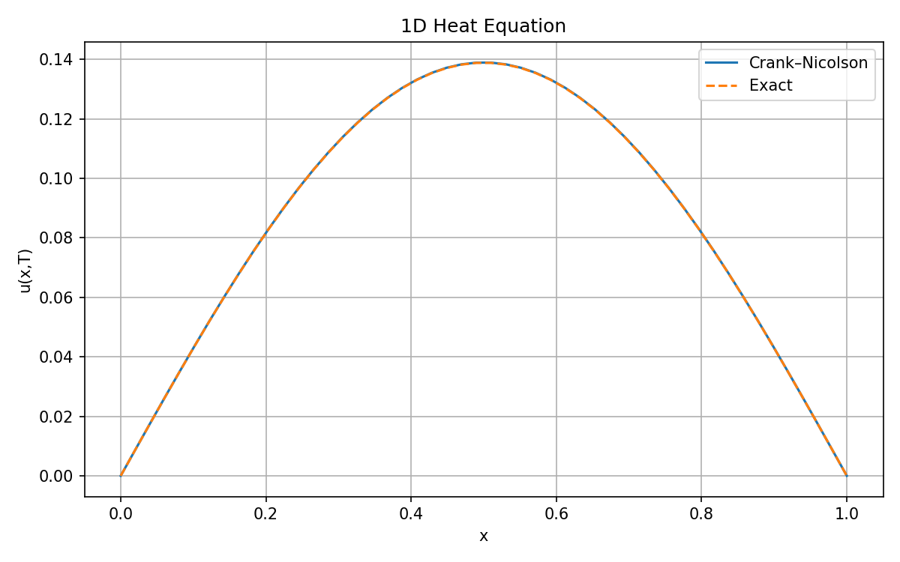
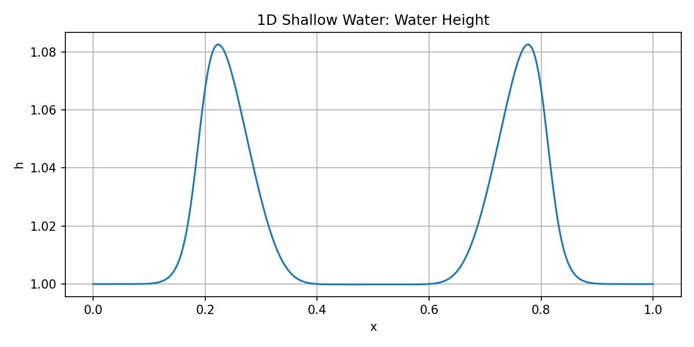
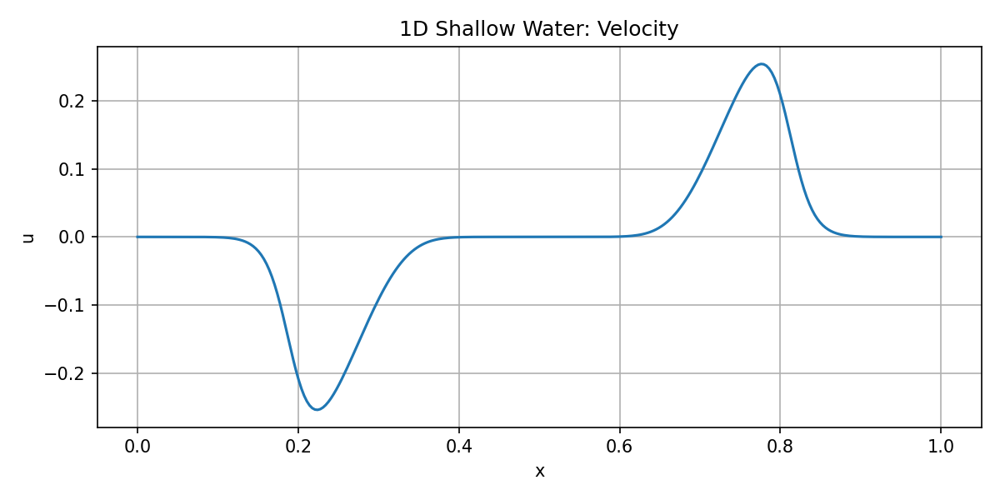
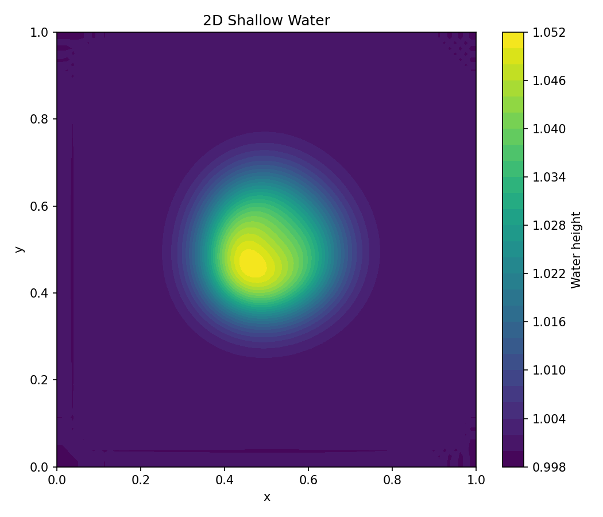
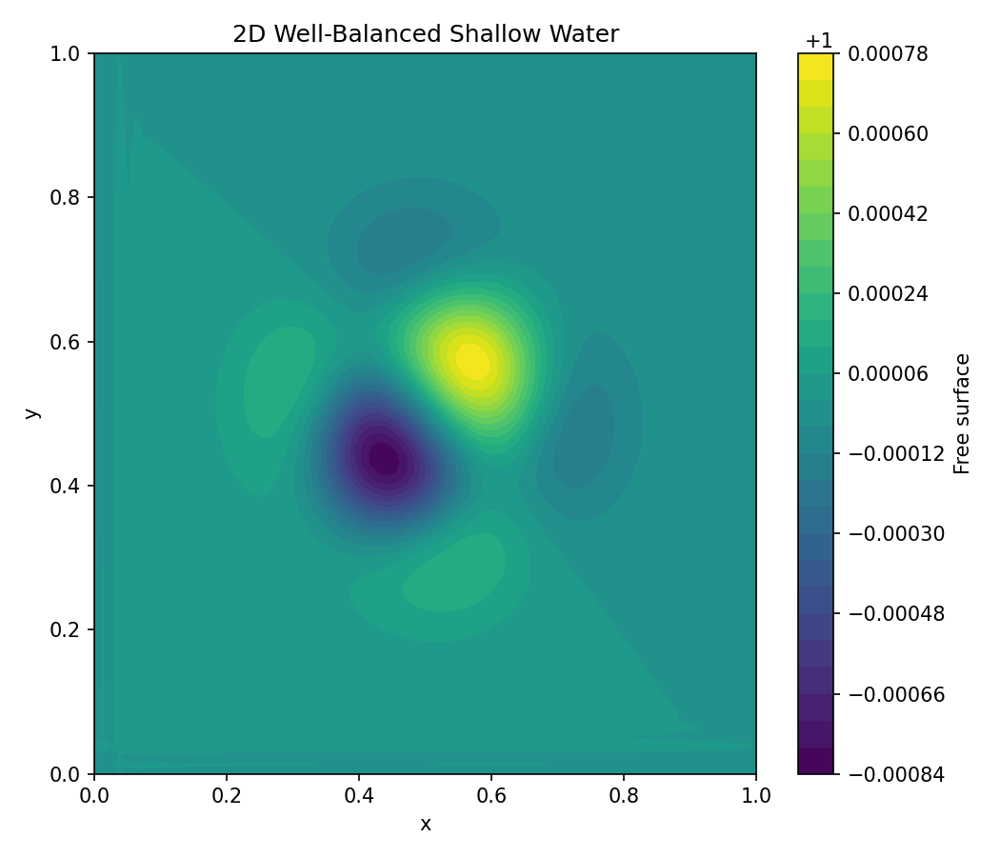

# Numerical Methods for PDEs (Scientific Computing Projects)

## Overview
This repository contains Python implementations of numerical methods for partial differential equations (PDEs), with applications to heat diffusion and shallow water flow.

These projects demonstrate:
- finite difference methods
- finite volume methods
- HLL approximate Riemann solvers
- well-balanced source-term treatment
- scientific computing using Python

These projects were developed to strengthen my preparation for PhD research in numerical methods for PDEs, shallow water models, and scientific computing.

---

## Repository Contents

### `heat_equation_CN_1D.py`
Implements the 1D heat equation using the Crank–Nicolson method.
- implicit time-stepping
- comparison with analytical solution
- plot of numerical solution

### `shallow_water_HLL_1D.py`
Implements a 1D shallow water solver using a finite volume method with HLL flux.
- nonlinear hyperbolic PDE system
- conservative variables
- water height and velocity plots

### `shallow_water_2D.py`
Implements a basic 2D shallow water simulation.
- coupled fluxes in two spatial dimensions
- contour plot of water height
- multi-dimensional PDE modelling

### `shallow_water_well_balanced_2D.py`
Implements a 2D shallow water model with bottom topography.
- source terms due to topography
- well-balanced style treatment
- free-surface contour plot

---

## How to Run

Install dependencies:

pip install -r requirements.txt

Run the scripts:

python heat_equation_CN_1D.py  
python shallow_water_HLL_1D.py  
python shallow_water_2D.py  
python shallow_water_well_balanced_2D.py  

---

## Example Outputs

### 1D Heat Equation

### 1D Shallow Water (Height)

### 1D Shallow Water (Velocity)

### 2D Shallow Water

### 2D Well-Balanced Shallow Water

---

## Technologies
- Python
- NumPy
- Matplotlib

---

## Author
**Rukevwe Jerome Ekpamaku**  
Applied Mathematics | Numerical PDEs | Scientific Computing

The implementations in this repository are simplified educational versions of methods widely used in computational fluid dynamics and numerical analysis research.

---

## References

The numerical methods implemented in this repository are based on standard literature in numerical PDEs and computational fluid dynamics:

1. LeVeque, R. J. (2002). *Finite Volume Methods for Hyperbolic Problems*. Cambridge University Press.  
2. Toro, E. F. (2001). *Shock-Capturing Methods for Free-Surface Shallow Flows*. Wiley.  
3. Kurganov, A. (2018). Finite-volume schemes for shallow-water equations. *Acta Numerica*.  
4. Audusse, E. et al. (2004). A fast and stable well-balanced scheme for the shallow water equations.  
5. Xing, Y. (2017). Numerical methods for the nonlinear shallow water equations.  

These works form the foundation of finite volume methods, Riemann solvers, and well-balanced schemes used in shallow water modelling.
